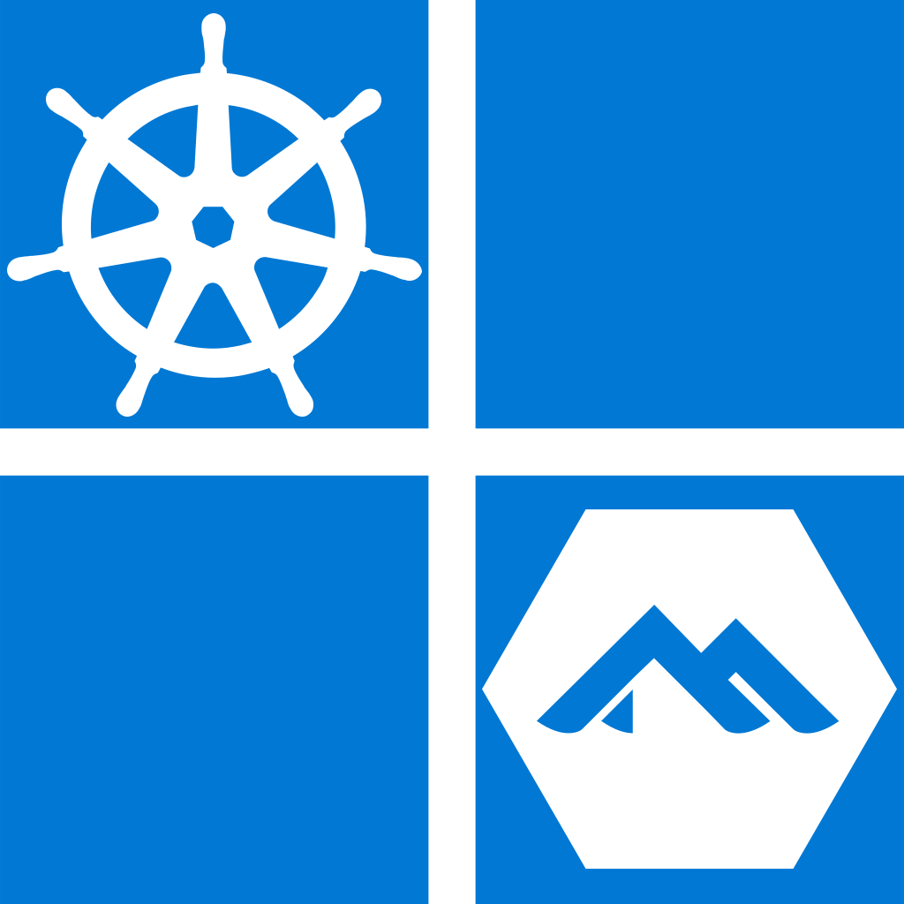

<div id="top"></div>

<!-- PROJECT SHIELDS -->

[![Go Version][go-version]][go-version]
[![Contributors][contributors-shield]][contributors-url]
[![Forks][forks-shield]][forks-url] [![Stargazers][stars-shield]][stars-url]
[![Issues][issues-shield]][issues-url]
[![Apache 2.0 License][license-shield]][license-url]
[![Experimental][stability]][license-url]
[![LinkedIn][linkedin-shield]][linkedin-url]

<!-- PROJECT LOGO -->
<br />
<div align="center">

  <a href="https://github.com/antoinemartin/kaweezle">
    
  </a>
  <h3 align="center">Kaweezle</h3>

  <p align="center">
    Run Vanilla Kubernetes on Windows with WSL 2 and Alpine Linux
    <br />
    <a href="https://github.com/antoinemartin/kaweezle"><strong>Explore the docs »</strong></a>
    <br />
    <br />
    <a href="https://github.com/antoinemartin/kaweezle/issues">Report Bug</a>
    ·
    <a href="https://github.com/antoinemartin/kaweezle/issues">Request Feature</a>
  </p>
</div>

[](https://asciinema.org/a/461421)

<!-- TABLE OF CONTENTS -->
<details>
  <summary>Table of Contents</summary>
  <ol>
    <li>
      <a href="#about-the-project">About The Project</a>
      <ul>
        <li><a href="#built-with">Built With</a></li>
      </ul>
    </li>
    <li>
      <a href="#getting-started">Getting Started</a>
      <ul>
        <li><a href="#prerequisites">Prerequisites</a></li>
        <li><a href="#installation">Installation</a></li>
      </ul>
    </li>
    <li><a href="#usage">Usage</a></li>
    <li><a href="#roadmap">Roadmap</a></li>
    <li><a href="#contributing">Contributing</a></li>
    <li><a href="#license">License</a></li>
    <li><a href="#contact">Contact</a></li>
    <li><a href="#acknowledgments">Acknowledgments</a></li>
  </ol>
</details>

<!-- ABOUT THE PROJECT -->

## About The Project

Kaweezle allows running a Kubernetes cluster on Windows using Windows Subsystem
for Linux 2 (WSL 2).

It works in a way similar to [Rancher Desktop](https://rancherdesktop.io/), but
it's simpler and is fully CLI based.

It is based on Alpine Linux. The resulting WSL distribution can also be used for
building Docker images with the help of Postman.

<p align="right">(<a href="#top">back to top</a>)</p>

### Built With

This project uses the following components:

- [go](https://go.dev/)
- [cobra](https://github.com/spf13/cobra)
- [logrus](github.com/sirupsen/logrus)
- [pterm](https://github.com/pterm/pterm)

<p align="right">(<a href="#top">back to top</a>)</p>

<!-- GETTING STARTED -->

## Getting Started

Kaweezle is better installed with [Scoop](https://scoop.sh/). The following
assumes you are using it.

### Prerequisites

To run kaweezle, you'll need to have
[WSL installed](https://docs.microsoft.com/en-us/windows/wsl/install).

The simplest way to install it is to run the following command:

```console
> wsl --install
```

After reboot, update the kernel and set the default version to version 2:

```console
> sudo wsl --update
> wsl --set-default-version 2
```

To use the kubernetes cluster, you will need to have kubectl installed:

```console
> scoop install kubectl
```

Other tools might be of insterest, like `k9s`, `kubectx`, `kubens` or `stern`.
All are available through scoop. You can install all of them at once with the
following command:

```console
> scoop install k9s kubectx kubens stern
```

### Installation

To install kaweezle, issue the following command:

```console
> scoop bucket add kaweezle https://github.com/antoinemartin/scoop-bucket
> scoop install kaweezle
```

<p align="right">(<a href="#top">back to top</a>)</p>

<!-- USAGE EXAMPLES -->

## Usage

First, install the kaweezle distribution with the following command:

```console
> kaweezle start
```

This will install the Kaweezle distribution, start it and install kubernetes on
it.

At the end of the installation you will have the following:

- The `kaweezle` distribution, running the current version of Kubernetes.
- A `kaweezle` kube context allowing to access the cluster.

**TODO**: Need some DNS to access the LB entrypoint ?

<p align="right">(<a href="#top">back to top</a>)</p>

<!-- ROADMAP -->

## Roadmap

- [x] Finish `install` command
- [x] Make rootfs downloadable
- [x] Make kaweezle installable via scoop
- [ ] Make kaweezle available on scoop extras bucket
- [ ] ...

See the [open issues](https://github.com/antoinemartin/kaweezle/issues) for a
full list of proposed features (and known issues).

<p align="right">(<a href="#top">back to top</a>)</p>

<!-- CONTRIBUTING -->

## Contributing

Any contributions you make are **greatly appreciated**.

If you have a suggestion that would make this better, please fork the repo and
create a pull request. You can also simply open an issue with the tag
"enhancement". Don't forget to give the project a star! Thanks again!

1. Fork the Project
2. Create your Feature Branch (`git checkout -b feature/AmazingFeature`)
3. Commit your Changes (`git commit -m 'Add some AmazingFeature'`)
4. Push to the Branch (`git push origin feature/AmazingFeature`)
5. Open a Pull Request

<p align="right">(<a href="#top">back to top</a>)</p>

<!-- LICENSE -->

## License

Distributed under the Apache License. See `LICENSE` for more information.

<p align="right">(<a href="#top">back to top</a>)</p>

<!-- CONTACT -->

## Contact

Antoine Martin - [@antoinemartin](https://twitter.com/antoinemartin)

Project Link:
[https://github.com/antoinemartin/kaweezle](https://github.com/antoinemartin/kaweezle)

<p align="right">(<a href="#top">back to top</a>)</p>

<!-- ACKNOWLEDGMENTS -->

## Acknowledgments

This project started from the amazing work made by
[yuk7](https://github.com/yuk7) with [wsldl](https://github.com/yuk7/wsldl) and
[AlpineWSL](https://github.com/yuk7/AlpineWSL).

It also uses the great work made by the Alpine Linux community on the edge
repository.

You may be interested by existing alternatives from which we have taken some
ideas:

- [Rancher Desktop](https://rancherdesktop.io/)
- [Minikube](https://github.com/kubernetes/minikube)
- [Kind](https://kind.sigs.k8s.io/)

By using
[kubeadm](https://kubernetes.io/docs/setup/production-environment/tools/kubeadm/create-cluster-kubeadm/)
and Alpine, kaweezle is closer to the clusters you may use on public clouds.

This readme has has been created from the
[Best-README-Template](https://github.com/othneildrew/Best-README-Template)
project.

<p align="right">(<a href="#top">back to top</a>)</p>

<!-- MARKDOWN LINKS & IMAGES -->
<!-- https://www.markdownguide.org/basic-syntax/#reference-style-links -->

[contributors-shield]:
  https://img.shields.io/github/contributors/antoinemartin/kaweezle.svg?style=flat
[contributors-url]:
  https://github.com/antoinemartin/kaweezle/graphs/contributors
[forks-shield]:
  https://img.shields.io/github/forks/antoinemartin/kaweezle.svg?style=flat
[forks-url]: https://github.com/antoinemartin/kaweezle/network/members
[stars-shield]:
  https://img.shields.io/github/stars/antoinemartin/kaweezle.svg?style=flat
[stars-url]: https://github.com/antoinemartin/kaweezle/stargazers
[issues-shield]:
  https://img.shields.io/github/issues/antoinemartin/kaweezle.svg?style=flat
[issues-url]: https://github.com/antoinemartin/kaweezle/issues
[license-shield]:
  https://img.shields.io/badge/license-apache_2.0-green?style=flat&logo=none
[license-url]: https://github.com/antoinemartin/kaweezle/blob/master/LICENSE
[linkedin-shield]:
  https://img.shields.io/badge/-LinkedIn-black.svg?style=flat&logo=linkedin&colorB=555
[linkedin-url]: https://linkedin.com/in/antoinemartin
[go-version]: https://img.shields.io/badge/Go-1.17+-00ADD8?style=flat&logo=go
[stability]:
  https://img.shields.io/badge/stability-experimental-orange?style=flat
